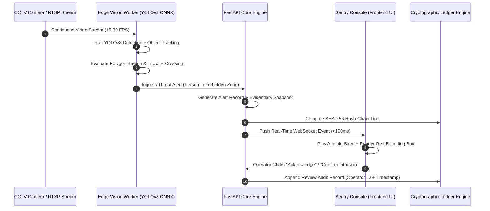
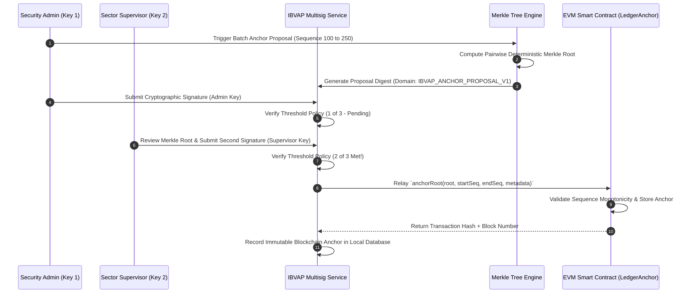

# Product Requirements Document (PRD)
## Intelligent Border Video Analytics Platform (IBVAP)

**Document Classification:** RESTRICTED / OPERATIONAL SPECIFICATION  
**Document Version:** 1.0.0 (Authoritative Consolidated Baseline)  
**Status:** Canonical Release  
**Last Updated:** September 2026  
**Target Submission / Implementation:** Smart India Hackathon (SIH) & Border Security Edge-to-Cloud Deployment  

---

## 1. Product Overview

### 1.1 Product Name
**IBVAP** — Intelligent Border Video Analytics Platform

### 1.2 One-Line Description
A mission-critical **Thin-Camera $\rightarrow$ Local GPU Hub $\rightarrow$ Tactical Dashboard** border surveillance intelligence system featuring low-bandwidth field frame streaming, high-throughput centralized base GPU inference, tactical spatial reasoning, and a 3-tier verifiable tamper-evident cryptographic audit chain (local SHA-256 hash-chain, deterministic Merkle proofs with AI model provenance, and 2-of-3 multisignature blockchain anchoring).

### 1.3 Product Vision
To provide sovereign border defense and security agencies with a practical, thermally resilient perimeter monitoring architecture that eliminates the fragility of placing expensive GPU compute on remote field poles, streams compressed lightweight frames over low-bandwidth tactical links to a central Forward Operating Base (FOB) GPU server, guarantees absolute legal chain-of-custody through mathematical proofs, and delivers instant threat alerts to sentry command dashboards.

### 1.4 Product Objective
1. **Practical Thin-Field Ingestion:** Stream lightweight, compressed video frames (H.264/H.265/MJPEG keyframes) from thin optical/thermal field cameras over bandwidth-constrained tactical radio, VSAT, or cellular links.
2. **Centralized Local GPU Acceleration:** Ingest and decode multiple camera feeds simultaneously on a protected Forward Operating Base (FOB) local GPU hub, executing sub-50ms YOLOv8 ONNX threat detection, directional tripwire crossing, and loitering evaluation.
3. **Automated Threat Dispatch:** Push prioritized threat events, bounding box coordinates, and encrypted snapshots to the sentry web dashboard in $< 100$ ms via WebSockets.
4. **Guarantee Evidentiary Integrity via 3-Tier Cryptography:** Provide tamper-evident, court-admissible audit logs by binding alerts to local SHA-256 hash-chains, O(log N) Merkle inclusion proofs, model provenance hashes, and decentralized 2-of-3 multisignature Ethereum/EVM blockchain anchors without ever leaking sensitive surveillance telemetry off-chain.
5. **Bandwidth Optimization & WAN Resilience:** Achieve $\ge 90\%$ bandwidth reduction over traditional raw streaming, maintaining full local recording and cryptographic integrity during external uplink blackouts.

---

## 2. Problem Statement

### 2.1 Current Problem
Modern national borders, remote military forward operating bases (FOBs), and strategic infrastructure perimeters span thousands of kilometers of rugged, unpopulated terrain. Security forces deploy hundreds of optical and thermal CCTV cameras feeding into command-and-control (C2) centers. However, this model faces critical operational failures:
* **Operator Fatigue & Vigilance Degradation:** Human operators experience severe cognitive fatigue after just 20 minutes of continuous screen monitoring, missing up to 73% of subtle intrusion events across multi-monitor video walls.
* **Severe Network Bandwidth Constraints:** Streaming continuous high-definition video from remote border outposts to centralized command centers is economically and physically infeasible over low-bandwidth satellite (VSAT), cellular, or tactical tactical radio links.
* **Vulnerability to Evidentiary Tampering & Insider Threat:** In contested border incidents or cross-border disputes, video recordings and database incident logs can be altered, truncated, or deleted by rogue insiders or sophisticated cyber adversaries, destroying legal chain of custody.
* **Lack of Model-Alert Provenance:** Traditional security software records alerts as raw database rows without recording which model weights, neural architectures, or spatial rule configurations generated the detection, leaving the output vulnerable to algorithmic spoofing allegations in legal inquiries.
* **Fragmented Tactical Response:** Detections are isolated to camera coordinate frames without converting to geospatial terrain maps, leaving field quick-reaction teams (QRT) without actionable intercept directions.

### 2.2 Who Experiences It
* **Border Security Forces & Defense Agencies (e.g., BSF, ITBP, Army Perimeter Security):** Field commanders and post sentries stationed at border outposts.
* **Command & Control (C2) Watch Officers:** Joint operations room duty officers monitoring multi-sector installations.
* **Forensic Investigators & Military Police:** Authorities investigating incursions, contraband smuggling, or border incidents requiring irrefutable, court-admissible proof.
* **Systems Engineers & Security Administrators:** Technicians responsible for remote node uptime, camera health, and cryptographic keys.

### 2.3 Why Existing Solutions Are Insufficient
* **Traditional VMS (Video Management Systems):** Provide passive recording and rudimentary pixel-change motion alerts that trigger hundreds of false alarms per hour caused by wind, foliage, animals, and weather changes.
* **Cloud-Dependent Vision AI Platforms:** Rely on streaming continuous video to centralized hyperscale clouds (AWS/GCP), failing completely during border tactical communication jamming or rural uplink drops.
* **Generic CCTV Analytics:** Lack border-specific spatial intelligence (directional tripwires, loitering dwell timers, camera tampering detection) and do not support ethical governance controls for facial recognition or automated license plate recognition (ANPR).
* **Conventional Audit Logging:** Standard database write-ahead logs (WAL) or centralized Syslog can be modified by database administrators (DBAs) with root access, lacking cryptographic mathematical immutability.

### 2.4 Impact of the Problem
Perimeter breaches go unnoticed until physical compromise occurs; sentries suffer exhaustion; critical operational bandwidth is saturated; and forensic evidence is disputed or ruled inadmissible in international tribunals or domestic courts due to broken chain-of-custody.

---

## 3. Target Users & Stakeholders

| User Role | Access Level | Primary Responsibilities | Key Needs |
|---|---|---|---|
| **Border Sentry / Console Operator** | `Operator` | Real-time monitoring of live camera grid, acknowledging instant threat alerts, marking visual false alarms, triggering manual emergency alarms. | Low-latency alerts (<100ms), clear bounding boxes, high-contrast UI ("Watermelon Command" dark palette), audible alert cues, one-click alert verification. |
| **Field Commander / QRT Dispatcher** | `Supervisor` | Reviewing sector-level geospatial map, assessing threat severity, dispatching Quick Reaction Teams (QRT), approving incident dispositions, signing multisig blockchain anchor proposals. | Sector status overview, tactical intercept vectors, cryptographic audit verification, batch review tools, multi-camera tracking. |
| **System Administrator / Security Officer** | `Admin` | Managing camera configurations, setting tripwires and polygon intrusion zones, creating user accounts, rotating cryptographic keys, deploying model weights, executing multisig anchor transactions. | Node health telemetry, worker thread metrics, network uplink monitoring, model hash governance, role-based access control (RBAC). |
| **Forensic Auditor / Legal Authority** | `Auditor` | Validating historical alert integrity, verifying Merkle inclusion proofs, verifying AI model provenance hashes, validating external EVM blockchain transactions. | Cryptographic verification tools, exportable tamper-evident proof bundles, zero-knowledge verification, immutable ledger inspection. |

---

## 4. Goals & Objectives

### 4.1 Quantitative Targets
* **End-to-End Latency:** < 100 ms from frame capture to operator alert dispatch on edge hardware (NVIDIA Jetson AGX Orin / Apple Silicon / x86_64 Edge Servers).
* **Detection Accuracy:** Precision $\ge 92\%$, Recall $\ge 88\%$ for person, vehicle, and weapon detection under varying day/night optical conditions.
* **Bandwidth Reduction:** $\ge 95\%$ reduction in uplink consumption by performing edge inference and streaming only alerts, cryptographic commitments, and lightweight preview snippets unless full stream is explicitly requested.
* **Cryptographic Verification Speed:** Deterministic Merkle inclusion proof generation and verification in $< 15$ ms for arbitrary batch sizes up to 100,000 alerts.
* **Fault Tolerance:** 100% alert retention and continuous local SHA-256 hash chaining during sustained WAN disconnection of $> 72$ hours.

### 4.2 Qualitative Goals
* **Operator Trust & Cognitive Clarity:** Standardized high-contrast visual design ("Watermelon Command") preventing eye strain and cognitive overload during extended night watches.
* **Irrefutable Chain of Custody:** Legal admissibility of tamper-evident alerts verified through mathematical Merkle paths and public/private EVM smart contract block timestamps.
* **SIH Hackathon Demonstration Excellence:** Clean end-to-end demonstrable flow including real-time video inference, zone breach alerting, interactive sector mapping, Merkle proof cryptographic verification, and 2-of-3 multisignature blockchain consensus.

---

## 5. Non-Goals

1. **Continuous Cloud Video Archiving:** IBVAP is not a multi-terabyte cloud continuous CCTV streaming/archiving service; edge nodes store ring-buffered footage locally and transmit structured metadata and alert evidence bundles.
2. **Autonomous Weaponization / Kinetic Response:** IBVAP provides decision support, threat detection, and telemetry; it does not directly control kinetic, lethal, or autonomous weapons.
3. **Off-Chain Surveillance Exposure:** The blockchain layer will NEVER store surveillance video, raw snapshots, GPS coordinates, facial recognition embeddings, license plate text, or personally identifiable information (PII). Only cryptographic root hashes and sequence ranges are committed on-chain.
4. **Ungrounded Generative AI:** IBVAP will not integrate hallucination-prone ungrounded large language models or speculative video generation into mission-critical tactical alert pipelines. Tactical recommendations are derived from deterministic rule engines and geospatial spatial heuristics.

---

## 6. Product Scope

### 6.1 In Scope
* **Multi-Camera Edge Ingestion:** RTSP, HTTP/MJPEG, local webcams, and synthetic video stream pipelines with bounded frame drop queues.
* **Computer Vision Pipeline:** Real-time YOLOv8 ONNX inference for 80 COCO classes, specialized person, vehicle, and knife/weapon identification, CentroidTracker object tracking, and optical camera tampering detection.
* **Spatial Threat Engine:** User-definable polygon exclusion zones, multi-point directional tripwires, dwell-time loitering thresholds, and configurable alert cooldown windows.
* **Ethical Governance Controls:** Strict role-gated, cryptographic approval mechanisms for sensitive biometric modules (facial recognition watchlist matching and ANPR).
* **3-Tier Cryptographic Architecture:**
  * *Tier 1:* Append-only local SQLite/PostgreSQL SHA-256 hash-chain ledger.
  * *Tier 2:* Pairwise deterministic Merkle tree engine generating $O(\log N)$ inclusion proofs, coupled with cryptographic AI Model Provenance hashing (model weight SHA-256, runtime environment, and rule configs).
  * *Tier 3:* Decentralized 2-of-3 multisignature Ethereum/EVM blockchain anchoring (`LedgerAnchor.sol` and `ILedgerAnchor.sol`) with domain-separated proposal hashing.
* **Operational Dashboard:** Responsive React 19 / Vite / TailwindCSS web console with live camera grid, interactive Leaflet/Canvas tactical map, alert review drawer, telemetry health cards, and cryptographic verification modal.
* **Resilient Offline Synchronization:** Local SQLite storage on edge nodes with transactional batch sync to central PostgreSQL command databases upon network reconnect.

### 6.2 Out of Scope
* Integration with commercial satellite constellations (Maxar/Planet) for real-time orbital imagery (planned for v3.0).
* Thermal FLIR sensor-fusion calibration at the hardware driver level (system ingests standardized RTSP thermal video streams).
* Hardware PCB fabrication for edge compute modules (software deploys on commercial off-the-shelf COTS edge hardware).

---

## 7. User Personas

```
+-----------------------------------------------------------------------------------+
| PERSONA 1: Sub-Inspector Vikram Singh (Field Sentry & Console Watch Officer)       |
+-----------------------------------------------------------------------------------+
| Role: Shift Operator, Border Outpost Alpha-4 (Western Sector)                    |
| Background: 8 years in border patrol. Operates 8-hour night shifts in remote post.|
| Pain Points: Severe eye fatigue from staring at 12 CCTV screens; misses wildlife  |
|   vs. human intrusions; unreliable radio connectivity during storms.               |
| Goals: Wants immediate, clear visual alerts with red bounding boxes when someone  |
|   crosses the border wire, with minimal false alarms from stray animals.          |
+-----------------------------------------------------------------------------------+

+-----------------------------------------------------------------------------------+
| PERSONA 2: Major Ananya Sharma (Sector Operations Commander & QRT Dispatcher)     |
+-----------------------------------------------------------------------------------+
| Role: Sector C2 Commander, Sector Operations Room                                |
| Background: 14 years military operations. Coordinates 6 forward outposts and QRTs.|
| Pain Points: Detections lack geospatial context; needs to know exact grid coords  |
|   and direction of movement to vector patrol teams efficiently.                   |
| Goals: A consolidated tactical map showing all camera sectors, instant threat     |
|   severities, automated intercept recommendations, and verified incident reports. |
+-----------------------------------------------------------------------------------+

+-----------------------------------------------------------------------------------+
| PERSONA 3: Dr. Rajiv Menon (Forensic Cyber Investigator & Legal Auditor)          |
+-----------------------------------------------------------------------------------+
| Role: Forensic Evidence Specialist, Military Provost Marshal                      |
| Background: Expert witness in legal tribunals and digital forensics.              |
| Pain Points: Digital surveillance footage presented in court is routinely accused |
|   of being doctored, edited, or fabricated by interested parties.                 |
| Goals: Needs mathematically verifiable proof (cryptographic hash chains, Merkle   |
|   proofs, smart contract block confirmations) that an alert and its evidence snapshot|
|   existed in an unaltered state at a specific historical microsecond.             |
+-----------------------------------------------------------------------------------+
```

---

## 8. User Journeys

### 8.1 Journey 1: Real-Time Perimeter Breach Detection & Sentry Verification


### 8.2 Journey 2: Tactical Intercept & Incident Escalation
1. **Detection:** A vehicle violates the buffer zone perimeter in Sector Charlie.
2. **Spatial Mapping:** The system projects the vehicle’s tracking vector onto the tactical 2D Leaflet map, estimating trajectory, velocity, and projected breach point.
3. **Tactical Recommendation:** The automated heuristic engine computes the nearest QRT unit (Patrol-Bravo at FOB 2, 1.4 km away) and generates an intercept vector.
4. **Dispatch:** The Watch Commander approves the tactical recommendation, escalating the alert to `HIGH_SEVERITY` and triggering automated dispatch notifications via C2 webhooks.

### 8.3 Journey 3: Cryptographic Audit & Multi-Signature Blockchain Anchoring


---

## 9. Core Features

### 9.1 Multi-Camera Video Ingestion Engine
* **Description:** Asynchronous, resilient ingestion pipeline supporting RTSP video streams, MJPEG feeds, static demo video files, USB webcams, and synthetic test generators.
* **User Value:** Enables deployment across heterogeneous hardware environments ranging from high-end PTZ border cameras to field USB scopes.
* **Functional Capabilities:**
  * Bounded frame drop queues preventing memory exhaustion and buffer bloat.
  * Automatic reconnection loops with exponential backoff on network stream interruption.
  * Real-time FPS calculation, dropped frame counters, and camera health telemetry.
* **Acceptance Criteria:** Must maintain $\ge 15$ FPS processing with zero unhandled memory leaks during a continuous 48-hour soak test.

### 9.2 YOLOv8 Edge Detection & Object Tracking Pipeline
* **Description:** High-throughput computer vision engine utilizing ONNX Runtime and PyTorch backends for deep neural network inference.
* **User Value:** Eliminates false alarms by classifying objects accurately (person, vehicle, animal, weapon) and tracking unique trajectories across frames.
* **Functional Capabilities:**
  * 80-class COCO object detection with dedicated filters for border security targets (`person`, `car`, `truck`, `bus`, `motorcycle`, `bicycle`, `knife/weapon`).
  * CentroidTracker association assigning persistent IDs across occlusions and trajectory pauses.
  * Optical camera tampering detection identifying lens occlusion, spray-painting, lens blindness, or sudden camera orientation shifts.
* **Acceptance Criteria:** Target classification precision $\ge 92\%$; tampering detection triggers within 3 seconds of optical occlusion.

### 9.3 Spatial Threat Rules & Zone Protection Engine
* **Description:** Mathematical coordinate boundary engine evaluating bounding-box ground coordinates against user-configured zones.
* **User Value:** Allows operators to define custom virtual security zones without needing physical fences.
* **Functional Capabilities:**
  * **Polygon Exclusion Zones:** Multi-point geometric inclusion/exclusion polygons defining forbidden border buffer zones.
  * **Directional Tripwires:** Vector tripwires triggering alerts only when crossed in specific forbidden directions (e.g., crossing from external border inward).
  * **Loitering & Dwell Timers:** Configurable loitering thresholds triggering alerts only when a tracked target remains in a zone $> T$ seconds.
  * **Alert Cooldown Logic:** Anti-flapping suppression preventing multiple duplicate alerts for the same continuous track ID within a defined cooldown window.
* **Acceptance Criteria:** Polygon breach fires within 1 frame of boundary intersection; loitering alerts fire within $\pm 0.5$ seconds of configured threshold.

### 9.4 Governed Facial Recognition & ANPR Engine
* **Description:** Biometric and license plate recognition subsystems strictly gated by constitutional, legal, and operational governance controls.
* **User Value:** Provides suspect watchlist identification and license plate recognition while preventing unauthorized surveillance abuse.
* **Functional Capabilities:**
  * Strict requirement for an active `GovernanceApproval` record (signed by authorized supervisor) before facial embeddings or plate text extraction can be executed.
  * Automated anonymization / blurring of unflagged bystander faces in exported evidence clips.
  * Watchlist database matching against calibrated cosine similarity thresholds.
* **Acceptance Criteria:** Any attempt to trigger biometric or ANPR ingestion without active governance token fails with `HTTP 403 Forbidden` and logs an audit violation.

### 9.5 3-Tier Cryptographic Audit & Evidentiary Ledger
* **Description:** Comprehensive multi-layer cryptographic integrity framework ensuring zero-trust evidentiary chain of custody.
* **User Value:** Guarantees that video evidence, incident timestamps, and operator actions cannot be repudiated or tampered with by any party.
* **Functional Capabilities:**
  * **Tier 1 (Local SHA-256 Chain):** Every alert generates an immutable record containing:
    $$\text{RecordHash} = \text{SHA256}(\text{PrevHash} \mathbin{\Vert} \text{AlertID} \mathbin{\Vert} \text{Timestamp} \mathbin{\Vert} \text{PayloadHash} \mathbin{\Vert} \text{SnapshotHash})$$
  * **Tier 2 (Deterministic Merkle Engine & Model Provenance):** Computes binary pairwise Merkle trees over alert ranges; generates $O(\log N)$ inclusion proofs for independent verification; computes cryptographic AI Model Provenance hashes binding detector weights (`model_artifact_hash`), ONNX runtime versions, and active spatial rule configurations.
  * **Tier 3 (2-of-3 Multisignature External Blockchain Anchor):** Batches alert ranges and commits Merkle roots to Ethereum/EVM smart contracts (`LedgerAnchor.sol`) governed by a 2-of-3 threshold signature policy using domain separator `IBVAP_ANCHOR_PROPOSAL_V1`.
* **Acceptance Criteria:** Any byte-level alteration to database rows causes immediate validation failure via `GET /ledger/verify`; Merkle inclusion proof verifies successfully against root in $< 15$ ms.

### 9.6 "Watermelon Command" Tactical Web UI
* **Description:** Professional, dark-mode mission control console engineered with TailwindCSS, Lucide icons, and React 19.
* **User Value:** Delivers maximum situational clarity under high-stress tactical conditions without visual clutter.
* **Functional Capabilities:**
  * **Multi-Camera Grid:** Dynamic layout supporting 1, 4, 9, or 16 synchronized camera streams with bounding box overlays and status badges.
  * **Interactive Tactical Map:** Leaflet/Canvas 2D sector map showing camera cones, geo-referenced alert pins, and QRT unit locations.
  * **Alert Management Drawer:** Filterable, sortable alert feed with visual snapshot lightboxes, audio alerts, and disposition workflows (`CONFIRMED`, `FALSE_POSITIVE`, `ESCALATED`, `RESOLVED`).
  * **Cryptographic Verification Modal:** Interactive utility allowing operators to inspect SHA-256 hash chains, download Merkle inclusion proofs, and view EVM transaction hashes.
* **Acceptance Criteria:** Fluid UI response ($\ge 60$ FPS); zero UI freezes during rapid alert bursts (100 alerts/sec); fully responsive across 1080p, 4K, and tactical tablet screens.

---

## 10. AI/ML Requirements

### 10.1 Computer Vision Models & Runtime
* **Primary Detector:** YOLOv8n / YOLOv8s (You Only Look Once) exported to ONNX format, executed via ONNX Runtime with execution provider fallback (`CUDAExecutionProvider` $\rightarrow$ `CoreMLExecutionProvider` $\rightarrow$ `CPUExecutionProvider`).
* **Webcam / Browser Prototype Detector:** TensorFlow.js COCO-SSD running directly in client browser for zero-install client-side camera evaluation.
* **Input Resolution:** Standardized $640 \times 640$ RGB pixel tensor normalized to $[0.0, 1.0]$.
* **Target Classes:** 
  * Class ID 0: `person` (Pedestrian intrusion)
  * Class IDs 1-3, 5, 7: `bicycle`, `car`, `motorcycle`, `bus`, `truck` (Vehicle perimeter breach)
  * Class ID 43: `knife` / weapon surrogate (Armed threat brandishing)
* **Confidence Threshold:** User-configurable per camera, default $\tau = 0.45$; Non-Maximum Suppression (NMS) IoU threshold $\text{IoU}_{\text{NMS}} = 0.45$.

### 10.2 Model Provenance Architecture
Every alert payload must record an immutable `ai_model_provenance` block containing:
1. `model_name`: Standardized architecture identifier (e.g., `yolov8n-onnx-coco`).
2. `model_version`: Semantic version string of the model release.
3. `model_artifact_hash`: Cryptographic SHA-256 hash of the exact binary weight file on disk.
4. `runtime_engine`: Execution provider details (e.g., `onnxruntime-1.16.3-cpu`).
5. `rule_config_hash`: SHA-256 digest of active polygon vertices and tripwire coordinates.
6. `simulation_flag`: Strict boolean discrimination (`true` for synthetic simulation benchmark, `false` for live inference weights).

```json
{
  "model_name": "yolov8n-onnx-coco",
  "model_version": "1.0.0",
  "model_artifact_hash": "e3b0c44298fc1c149afbf4c8996fb92427ae41e4649b934ca495991b7852b855",
  "runtime_engine": "onnxruntime-1.22.0-darwin-arm64",
  "rule_config_hash": "a1b2c3d4e5f67890123456789abcdef0123456789abcdef0123456789abcdef0",
  "simulation_flag": false
}
```

### 10.3 Tactical Heuristics & Spatial Reasoning (No Fake LLMs)
Tactical intercept recommendations are computed deterministically without speculative ungrounded language models:
* **Target Velocity Vector:** Calculated from tracking history over past $N = 30$ frames:
  $$\vec{v} = \frac{\mathbf{p}_{t} - \mathbf{p}_{t - \Delta t}}{\Delta t}$$
* **Intercept Vector:** Euclidean distance and road-network distance minimization to nearest available patrol unit:
  $$\text{Unit}_{\text{best}} = \arg\min_{u \in \text{Units}} \left( \frac{\|\mathbf{p}_{\text{target}} - \mathbf{p}_u\|}{v_u} \right)$$

---

## 11. Functional Requirements

| Requirement ID | Module | Description | Priority |
|---|---|---|---|
| **FR-VID-001** | Ingestion | System shall ingest RTSP video streams via OpenCV / PyAV with automated reconnection logic. | Critical |
| **FR-VID-002** | Ingestion | System shall enforce a bounded frame queue (max 5 frames) to prevent buffer bloat and stale inference. | Critical |
| **FR-VID-003** | Ingestion | System shall support dynamic addition, modification, and deletion of cameras without service restarts. | High |
| **FR-DET-001** | Detection | System shall detect persons, vehicles, and weapons in video frames with latency $< 50$ ms per frame. | Critical |
| **FR-DET-002** | Tracking | System shall maintain persistent centroid tracking IDs for targets across temporary frame occlusions. | High |
| **FR-DET-003** | Tampering | System shall detect camera blinding, occlusion, and sudden pan/tilt shifts within 3.0 seconds. | High |
| **FR-RUL-001** | Rules | System shall evaluate bounding boxes against arbitrary convex/concave polygon exclusion zones. | Critical |
| **FR-RUL-002** | Rules | System shall evaluate directional vector tripwires with single-direction alert triggers. | High |
| **FR-RUL-003** | Rules | System shall support configurable dwell-time thresholds for loitering detection. | High |
| **FR-RUL-004** | Rules | System shall apply configurable alert cooldown periods per object track to prevent event spam. | Medium |
| **FR-GOV-001** | Governance | System shall prohibit execution of facial recognition unless an active, valid `GovernanceApproval` exists. | Critical |
| **FR-GOV-002** | Governance | System shall prohibit execution of ANPR extraction unless an active, valid `GovernanceApproval` exists. | Critical |
| **FR-ALT-001** | Alerts | System shall store alert records with timestamp, camera ID, zone ID, target class, confidence, and snapshot. | Critical |
| **FR-ALT-002** | Alerts | System shall dispatch alerts over WebSockets to connected client consoles within 100 ms of detection. | Critical |
| **FR-ALT-003** | Alerts | System shall support alert lifecycle transitions: `NEW` $\rightarrow$ `ACKNOWLEDGED` $\rightarrow$ `RESOLVED` / `FALSE_POSITIVE`. | High |
| **FR-ALT-004** | Alerts | System shall encrypt and store evidence snapshot images on local disk using AES-256-GCM. | High |
| **FR-GEO-001** | Spatial | System shall map camera coordinates to 2D/3D geospatial coordinates on sector map. | High |
| **FR-GEO-002** | Spatial | System shall compute tactical patrol intercept vectors for confirmed intrusions. | Medium |
| **FR-LED-001** | Ledger Tier 1 | System shall append every alert and review action to a local SHA-256 cryptographic hash-chain. | Critical |
| **FR-LED-002** | Ledger Tier 1 | System shall provide `GET /ledger/verify` endpoint verifying whole-chain mathematical integrity. | Critical |
| **FR-MP-001** | Ledger Tier 2 | System shall construct deterministic pairwise Merkle trees over alert batches. | Critical |
| **FR-MP-002** | Ledger Tier 2 | System shall generate compact $O(\log N)$ inclusion proofs for individual alerts via API. | Critical |
| **FR-MP-003** | Ledger Tier 2 | System shall bind AI model provenance hashes (weights, runtime, rule hashes) to Merkle leaf records. | Critical |
| **FR-MS-001** | Ledger Tier 3 | System shall construct multisignature anchor proposals using domain separator `IBVAP_ANCHOR_PROPOSAL_V1`. | High |
| **FR-MS-002** | Ledger Tier 3 | System shall enforce a 2-of-3 threshold signature policy across distinct Admin and Supervisor roles. | High |
| **FR-MS-003** | Ledger Tier 3 | System shall commit approved Merkle roots to EVM smart contract `LedgerAnchor.sol` and record tx hash. | High |
| **FR-SEC-001** | Security | System shall enforce JWT authentication and Role-Based Access Control (`Admin`, `Supervisor`, `Operator`, `Auditor`). | Critical |
| **FR-SEC-002** | Security | System shall isolate multi-site camera data by military sector / installation ID. | High |
| **FR-UI-001** | Frontend | System shall render responsive multi-camera live feeds with SVG bounding box overlays. | High |
| **FR-UI-002** | Frontend | System shall display dynamic telemetry indicators showing stream health, FPS, and model execution times. | Medium |
| **FR-UI-003** | Frontend | System shall provide an interactive cryptographic ledger audit modal displaying chain status and Merkle proofs. | High |
| **FR-INT-001** | Integration | System shall dispatch standardized JSON alert webhooks to external Command & Control (C2) systems. | High |
| **FR-INT-002** | Integration | System shall interface with Ethereum/EVM JSON-RPC endpoints for smart contract interaction. | Medium |

---

## 12. Non-Functional Requirements (NFRs)

### 12.1 Performance
* **Inference Frame Rate:** $\ge 20$ FPS per camera stream on edge hardware accelerator; $\ge 10$ FPS on multi-core CPU edge fallback.
* **Alert Latency:** Sub-100 ms total elapsed time from frame capture to WebSocket dispatch on local LAN.
* **API Response Times:** 95th percentile ($P_{95}$) response time $< 50$ ms for operational endpoints (`/alerts`, `/cameras`, `/telemetry`).
* **Proof Generation:** Merkle inclusion proof computation $< 15$ ms for batch size $N = 10,000$.

### 12.2 Scalability
* **Edge Node Capacity:** Single edge compute unit supports up to 4 concurrent 1080p RTSP streams with continuous AI analytics.
* **Central Command Server:** Scales to 100+ edge nodes with central PostgreSQL clustering.
* **Storage Footprint:** Compact database schema using $< 5$ KB per alert record (excluding compressed JPEG snapshot).

### 12.3 Reliability & Availability
* **Service Availability:** $99.95\%$ uptime target for core edge detection daemon.
* **Memory Bounds:** Zero unbounded memory growth; bounded video queues ensure memory utilization remains $< 2.0$ GB on edge nodes.
* **Crash Recovery:** Automatic process supervision via Systemd / Docker with state reconstruction from local SQLite database in $< 5$ seconds.

### 12.4 Security & Privacy
* **Zero Off-Chain PII:** No surveillance imagery, facial embeddings, vehicle plates, or coordinates committed to blockchain.
* **Evidence Encryption:** Snapshot images and video clips encrypted at rest with AES-256-GCM.
* **Transport Security:** All web console and API communications encrypted via TLS 1.3.
* **Audit Immutability:** Hash-chain entries are strictly append-only; database write permissions restrict updates to disposition status columns only.

### 12.5 Maintainability & Deployability
* **Containerized Deployment:** Docker and Docker-Compose multi-container deployment for edge and cloud.
* **Edge Portability:** Pure Python / FastAPI backend with cross-platform ONNX Runtime support across x86_64, ARM64 (Apple Silicon, Raspberry Pi 5, Jetson).
* **Test Coverage:** Automated unit and regression test suite covering $\ge 90\%$ of core detection, ledger, and cryptographic modules.

---

## 13. System Architecture

### 13.1 High-Level Architecture Diagram
```
+----------------------------------------------------------------------------------------------------+
|                                           IBVAP PLATFORM                                           |
|                  (Thin Field Camera ──► Local Base GPU Hub ──► Tactical Dashboard)                 |
+----------------------------------------------------------------------------------------------------+

 [ THIN FIELD CAMERAS (NO FIELD GPU REQUIRED) ]
   │
   ├─► Optical Border CCTV Pole (H.264/H.265 sub-sampled keyframes)
   ├─► Thermal Long-Wave IR Camera (Low-FPS grayscale feed)
   └─► Checkpost Entry Gate Camera (MJPEG / RTSP)
         │
         ▼  [ LOW-BANDWIDTH TRANSPORT: Tactical RF / VSAT / 4G / Fiber ]
         │  (Bandwidth-optimized compressed stream, ~250-500 kbps per camera)
         ▼
+----------------------------------------------------------------------------------------------------+
| [ LOCAL GPU SERVER HUB ] (Protected FOB Command Bunker / Headquarters)                             |
|                                                                                                    |
|  1. INGESTION & BOUNDED BUFFER                                                                     |
|     (Decodes incoming packets; drop-oldest FIFO queue; jitter smoothing)                           |
|                                                                                                    |
|  2. CENTRALIZED GPU AI ENGINE                                                                      |
|     (High-throughput YOLOv8 ONNX on NVIDIA RTX/Orin; CentroidTracker; Tamper Detector)              |
|                                                                                                    |
|  3. SPATIAL & ETHICAL RULES ENGINE                                                                 |
|     (Multi-point polygon exclusion; directional tripwires; loiter timers; biometric governance)    |
|                                                                                                    |
|  4. 3-TIER CRYPTOGRAPHIC LEDGER ENGINE                                                             |
|     ├─► Tier 1: Local SHA-256 Hash Chain (Immutable event log)                                     |
|     ├─► Tier 2: Pairwise Deterministic Merkle Trees + AI Model Weight Provenance                   |
|     └─► Tier 3: 2-of-3 Multisig EVM Blockchain Anchoring (LedgerAnchor.sol)                        |
|                                                                                                    |
|  5. DISPATCH & EVIDENTIARY VAULT                                                                   |
|     ├─► AES-256-GCM Encrypted Snapshot Storage                                                     |
|     └─► Real-Time WebSocket Broadcaster (< 100 ms alert dispatch)                                  |
+----------------------------------------------------------------------------------------------------+
         │
         ▼  [ LOCAL SECURE LAN / CONSOLE LINK ]
         │  (WebSockets for events + REST API for management)
         ▼
 [ "WATERMELON COMMAND" TACTICAL SENTRY DASHBOARD ]
   ├─► Live Multi-Camera Grid (CAM-01 through CAM-04)
   ├─► Real-Time Breach Alarms with SVG Target Bounding Boxes
   ├─► 2D/3D Geospatial Tactical Map with QRT Intercept Vectors
   └─► Forensic Ledger Verification Modal (SHA-256, Merkle proofs, EVM block receipts)
```

### 13.2 Detailed Architectural Data Flow
$$\text{Thin Camera Frame} \xrightarrow{\text{Compress / Subsample}} \text{Low-Bandwidth Stream } (\text{H.264 / MJPEG})$$
$$\xrightarrow{\text{Uplink}} \text{Local GPU Hub Decode} \xrightarrow{\text{YOLOv8 GPU}} \text{Detections } \{\text{bbox}, \text{class}, \text{conf}\}$$
$$\xrightarrow{\text{Tracking \& Spatial Rules}} \text{Threat Violation Event} \xrightarrow{\text{3-Tier Ledger}} \begin{cases} \text{Tier 1: Local SHA-256 Chain} \\ \text{Tier 2: Merkle Tree + Model Hash} \\ \text{Tier 3: 2-of-3 Multisig EVM Anchor} \end{cases}$$
$$\xrightarrow{\text{WebSocket (<100ms)}} \text{Tactical Command Dashboard (Visual / Audio Alarm)}$$

---

## 14. Data Requirements & Schema

### 14.1 Key Database Entities (Relational Schema)

#### `cameras`
* `id` (String, Primary Key): Unique camera identifier (e.g., `cam-01`).
* `name` (String): Human-readable name (e.g., `Sector Alpha Forward Watch`).
* `stream_url` (String): RTSP / HTTP stream connection URI.
* `location_lat` / `location_lng` (Float): Geospatial coordinates of camera mount.
* `status` (Enum): `ONLINE`, `OFFLINE`, `DEGRADED`, `TAMPERED`.
* `is_active` (Boolean): Master enable switch.

#### `alerts`
* `id` (String, Primary Key): UUIDv4 string.
* `camera_id` (String, Foreign Key): Originating camera.
* `zone_id` (String): Zone or tripwire violated.
* `timestamp` (DateTime): UTC timestamp of event.
* `target_type` (String): Detected class (`person`, `vehicle`, `weapon`, etc.).
* `confidence` (Float): Model confidence score ($0.0 \le c \le 1.0$).
* `severity` (Enum): `LOW`, `MEDIUM`, `HIGH`, `CRITICAL`.
* `status` (Enum): `NEW`, `ACKNOWLEDGED`, `RESOLVED`, `FALSE_POSITIVE`.
* `snapshot_path` (String): Local filesystem path to encrypted frame snapshot.
* `bounding_box` (JSON): Normalized coordinates `[ymin, xmin, ymax, xmax]`.
* `ai_model_provenance` (JSON): Model name, version, artifact hash, runtime, rule hash.

#### `ledger_records` (Tier 1 Hash-Chain)
* `id` (Integer, Primary Key, Autoincrement): Monotonic sequence number.
* `record_type` (String): `ALERT_CREATED`, `ALERT_REVIEWED`, `GOVERNANCE_GRANTED`.
* `entity_id` (String): Foreign reference to alert or governance ID.
* `payload_hash` (String): SHA-256 hash of alert data fields.
* `previous_hash` (String): SHA-256 hash of record $N-1$ (`0x000...` for genesis).
* `record_hash` (String): SHA-256 hash of current record composite.
* `timestamp` (DateTime): Record creation timestamp.

#### `anchors` (Tier 3 Blockchain Anchors)
* `id` (Integer, Primary Key): Anchor record ID.
* `merkle_root` (String): 32-byte hexadecimal Merkle root.
* `start_sequence` (Integer): First included ledger record sequence.
* `end_sequence` (Integer): Last included ledger record sequence.
* `record_count` (Integer): Total alerts covered by anchor.
* `transaction_hash` (String): EVM transaction hash.
* `block_number` (Integer): EVM block height confirmation.
* `status` (Enum): `PROPOSED`, `SIGNED`, `CONFIRMED`, `FAILED`.

---

## 15. API & Third-Party Integrations

### 15.1 Core REST & WebSocket Endpoints

| Method | Path | Description | Access Level |
|---|---|---|---|
| `GET` | `/health` | System readiness, worker metrics, and hardware state. | Public |
| `GET` | `/cameras` | List configured cameras with streaming status and FPS. | Operator |
| `POST` | `/cameras` | Register a new camera stream and configure zones. | Admin |
| `GET` | `/alerts` | Query historical alerts with filtering and pagination. | Operator |
| `GET` | `/alerts/{id}` | Retrieve complete alert payload, snapshot, and provenance. | Operator |
| `PATCH` | `/alerts/{id}` | Update alert disposition (`ACKNOWLEDGED`, `RESOLVED`). | Operator |
| `WS` | `/ws/alerts` | Real-time WebSocket event stream for instantaneous alerts. | Operator |
| `GET` | `/ledger/records` | Query Tier 1 local hash-chain audit log. | Auditor |
| `GET` | `/ledger/verify` | Execute full mathematical verification of hash chain. | Auditor |
| `GET` | `/alerts/{id}/merkle-proof` | Retrieve deterministic Merkle inclusion proof for alert. | Auditor |
| `POST` | `/ledger/proof/verify` | Validate arbitrary Merkle proof against known root. | Auditor |
| `POST` | `/anchoring/propose` | Create 2-of-3 multisig proposal to anchor Merkle root. | Admin |
| `POST` | `/anchoring/sign` | Submit signature for pending anchor proposal. | Supervisor |
| `GET` | `/anchoring/status` | Query active proposals and on-chain anchor transactions. | Auditor |

### 15.2 External Integrations
* **EVM Blockchain Provider:** JSON-RPC interface to Ethereum Sepolia / Polygon / local Hardhat node via Web3.py.
* **Command & Control (C2) Webhooks:** Configurable HTTPS POST webhooks dispatching alert payloads in MIL-STD compliant JSON format.

---

## 16. UI/UX Requirements ("Watermelon Command")

### 16.1 Design System & Color Palette
The interface adheres strictly to the mission-critical **Watermelon Command** dark-mode palette designed for night-watch clarity:
* **Background Deep Carbon:** `#0f1216` (Reduces eye fatigue in darkened operations rooms).
* **Card & Surface Slate:** `#171b22` / `#1e242c` (High visual hierarchy separation).
* **Threat Crimson (Watermelon Red):** `#ff4d6d` / `#ef233c` (High-urgency visual alarms and breach boxes).
* **Operational Emerald (Leaf Green):** `#2ec4b6` / `#20bf6b` (Normal status, active cameras, verified proofs).
* **Instrumentation Cyan:** `#00b4d8` (Telemetry rates, tracking vectors, and active tripwires).
* **Text & Contrast:** High-contrast crisp off-white `#f8f9fa` for data; muted gray `#8b949e` for metadata.

### 16.2 Key Views & Interactions
1. **Command Dashboard:** Top header with system readiness status, live clock, alert badge counters, and camera grid selector.
2. **Interactive Viewport:** Main viewport rendering selected camera stream with crisp SVG bounding boxes, target velocity vectors, and zone boundary lines.
3. **Tactical Geospatial Map:** Dynamic Leaflet map displaying camera coverage cones, geo-located breach pins, and patrol unit vectors.
4. **Alerts Feed & Lightbox Drawer:** Chronological alert stream with audio chime, severity badges, and instant modal lightbox for examining evidentiary snapshot crops.
5. **Cryptographic Verification Modal:** Step-by-step cryptographic auditor allowing operators to verify SHA-256 chains, inspect leaf sibling hashes, and open blockchain block explorer links.

---

## 17. Multilingual & Voice Requirements

### 17.1 Multilingual Interface
* **Supported Languages:** English (default), Hindi (हिन्दी), and regional operational dialects (planned for v2.0).
* **Localization Scope:** All UI labels, navigation buttons, alert descriptions, and system notifications are externalized into key-value localization bundles.

### 17.2 Voice & Audio Signals
* **Audible Alert Sirens:** Distinct synthesized tone frequencies based on alert severity:
  * *Critical (Weapon / Breach):* Rapid dual-frequency pulsed chime (880 Hz / 440 Hz).
  * *Warning (Loitering / Tamper):* Single 440 Hz chime.
* **Text-to-Speech (TTS) Tactical Alerts:** Synthesized voice announcement for hands-free sentry notification: *"Alert: Person intrusion detected, Sector Alpha-4."*

---

## 18. Personalization & Workspaces

* **User Preferences:** Local storage persistence of UI state (active camera grid layout, audio mute toggle, map zoom level, alert filter presets).
* **Multi-Sector Isolation:** Operators assigned to specific operational sectors (e.g., Sector 1 vs Sector 2) only see camera feeds and alerts relevant to their assigned area of responsibility.

---

## 19. Assessment, Analytics & Reporting

### 19.1 Tactical Operations Analytics
* **Incident Density Heatmaps:** Visual 2D spatial heatmap identifying recurring breach hotspots along the perimeter over 24-hour, 7-day, and 30-day windows.
* **Temporal Trend Analysis:** Peak breach hour histograms allowing commanders to optimize guard shift rotations and sentry placement.
* **False Positive Tracking:** Analytic breakdown of alerts marked `FALSE_POSITIVE` by sentries to identify cameras requiring rule recalibration.

### 19.2 Forensic Evidence Export
* **One-Click Evidentiary Bundle:** Generates a signed, self-contained ZIP archive containing:
  * Encrypted JPEG snapshot of breach.
  * 10-second MP4 video clip (5s pre-event buffer + 5s post-event buffer).
  * Alert JSON metadata with model provenance block.
  * Cryptographic Merkle inclusion proof file.
  * EVM blockchain transaction receipt.
  * Offline HTML verification utility for court presentations.

---

## 20. Security, Privacy & Ethical Governance

### 20.1 Role-Based Access Control (RBAC)

| Permission / Action | Operator | Supervisor | Admin | Auditor |
|---|:---:|:---:|:---:|:---:|
| View Live Camera Feeds & Map | Yes | Yes | Yes | No |
| Acknowledge / Resolve Alerts | Yes | Yes | Yes | No |
| Configure Cameras & Spatial Zones | No | No | Yes | No |
| Approve Facial / ANPR Governance | No | Yes | Yes | No |
| Sign Blockchain Anchor Proposals | No | Yes | Yes | No |
| Inspect Ledger & Verify Merkle Proofs| Yes | Yes | Yes | Yes |
| Manage User Credentials & Roles | No | No | Yes | No |

### 20.2 Ethical Privacy Governance
* **Proportionality Principle:** General perimeter detection relies purely on generic class detection (`person`, `vehicle`). Biometric identification (Facial Recognition) is disabled by default.
* **Governance Tokens:** Facial Recognition and ANPR require a digitally signed `GovernanceApproval` specifying:
  * Legal justification / FIR case number.
  * Authorized operational duration (max 8-hour auto-expiring token).
  * Authorizing officer digital signature.
* **Bystander Protection:** Unflagged individuals detected in public border crossings have facial features dynamically blurred on operator screens.

---

## 21. Success Metrics & Key Performance Indicators (KPIs)

| Metric | Target Baseline | Measurement Method |
|---|---|---|
| **Intrusion Detection Rate (Recall)** | $\ge 90\%$ | Controlled field penetration drills and synthetic test suites. |
| **False Alarm Rate** | $\le 5\%$ of total alerts | Sentries marking alerts as `FALSE_POSITIVE` in daily logs. |
| **Mean Time to Detect (MTTD)** | $< 100$ ms | Elapsed time from frame ingress to WebSocket alert dispatch. |
| **Mean Time to Respond (MTTR)** | $< 30$ seconds | Sentry acknowledgment timestamp minus alert creation timestamp. |
| **System Uptime** | $\ge 99.9\%$ | Continuous automated health check monitoring. |
| **Evidentiary Tamper Resistance** | $100\%$ detection | Zero undetected database alterations in cryptographic audit suites. |

---

## 22. Technical Constraints

* **Edge Compute Hardware:** Must execute comfortably on edge compute nodes with 8 GB RAM and 4-core CPUs (x86_64 or ARM64).
* **Storage Footprint:** Disk storage on edge nodes must operate under a strict ring-buffer limit (max 100 GB for snapshots and video clips).
* **Network Independence:** System must remain fully operational without internet or cloud connectivity; external blockchain anchoring executes opportunistically when uplink is established.
* **Web Browser Compatibility:** Modern standards-compliant browsers (Chromium 110+, Firefox 115+, Safari 16+) with WebAssembly and WebGL support.

---

## 23. Assumptions

* Border security cameras are positioned with stable, non-obstructed fields of view covering designated perimeter lines.
* Edge nodes have access to an uninterruptible power supply (UPS / solar battery backup) ensuring clean shutdowns.
* Security personnel operating the console have completed standard basic sentry training.
* Authorized supervisors signing blockchain anchor proposals possess secure cryptographic private key storage (hardware security module or encrypted keystore).

---

## 24. Risks & Mitigations

| Risk | Severity | Likelihood | Mitigation Strategy |
|---|:---:|:---:|---|
| **Severe Weather Optical Degradation (Heavy Fog, Monsoons, Sandstorms)** | High | High | Integrate dynamic contrast enhancement (CLAHE); fall back to thermal imaging feeds; flag low-visibility camera status to sentries. |
| **Adversarial Tampering / Physical Camera Destruction** | High | Medium | Optical camera tampering algorithm detects sudden loss of signal, occlusion, or orientation shift within 3 seconds, sounding immediate alarm. |
| **WAN Network Blackout during Incursion** | High | High | Edge nodes maintain autonomous local SHA-256 hash chains and ring buffers; queue anchor proposals locally for batch submission upon reconnection. |
| **Rogue Insider Modifying Local Database** | Critical | Low | Local SHA-256 hash-chain immediately detects corrupted hashes; Merkle root mismatch alerts central command upon uplink sync. |
| **Blockchain Network Congestion / High Gas Fees** | Medium | Medium | Batched anchoring commits thousands of alerts in a single Merkle root transaction; system supports gas-free local mock/private EVM networks. |

---

## 25. Future Scope & Roadmap

* **v2.0 (Post-Hackathon Edge Hardening):**
  * Hardware accelerated TensorRT execution engine for NVIDIA Jetson platforms.
  * Direct thermal sensor fusion combining optical RGB and FLIR long-wave infrared streams.
  * Zero-knowledge (zk-SNARK) privacy proofs allowing auditors to verify alert validity without revealing sensitive time or location coordinates.
* **v3.0 (Autonomous Drone & Strategic Integration):**
  * Automated tethered drone dispatch to breach coordinates upon confirmed intrusion.
  * Satellite radar (SAR) layer integration for wide-area border monitoring.

---

## 26. Acceptance Criteria

* [ ] **Video Processing:** Ingests at least 4 concurrent video streams at $\ge 15$ FPS with CPU utilization $< 70\%$.
* [ ] **Object Detection:** Identifies a human entering a defined polygon zone and generates an alert with bounding box within 100 ms.
* [ ] **Tampering Alarm:** Spray-painting or covering camera lens triggers `CAMERA_TAMPERED` alert within 3 seconds.
* [ ] **Local Hash-Chain:** Every alert creates a valid sequential `LedgerRecord`; modifying any database field causes `GET /ledger/verify` to fail.
* [ ] **Merkle Inclusion Proof:** Endpoint `/alerts/{id}/merkle-proof` generates a valid proof verifying against the current batch root.
* [ ] **AI Model Provenance:** Alert payload includes valid SHA-256 hash of model weights and active rule coordinates.
* [ ] **Multisig Governance:** Creating an on-chain anchor proposal requires 2 distinct signatures from authorized roles before transaction dispatch.
* [ ] **Tactical UI:** React web console renders live streams, real-time alert toast notifications, interactive Leaflet map, and cryptographic audit modal.

---

## 27. Traceability Matrix

| Requirement ID | Feature Name | Technical Component / File | Verification / Test Case |
|---|---|---|---|
| **FR-VID-001** | Multi-Stream Ingestion | `app/stream_manager.py` | `test_stream_manager.py` |
| **FR-DET-001** | YOLOv8 Object Detection | `app/yolo_detector.py` | `test_yolo_detector.py` |
| **FR-DET-003** | Camera Tampering Detection | `app/tampering_detector.py` | `test_tampering_detector.py` |
| **FR-RUL-001** | Polygon Spatial Zones | `app/spatial_engine.py` | `test_spatial_engine.py` |
| **FR-GOV-001** | Biometric Governance | `app/governance.py` | `test_governance.py` |
| **FR-ALT-001** | Alert Lifecycle Engine | `app/main.py`, `app/models.py` | `test_alerts_pipeline.py` |
| **FR-LED-001** | Tier 1 SHA-256 Ledger | `app/ledger.py` | `test_ledger_integrity.py` |
| **FR-MP-001** | Tier 2 Merkle Tree Engine | `app/merkle_engine.py` | `test_advanced_blockchain_integrity_suite.py` |
| **FR-MP-003** | AI Model Provenance | `app/provenance_service.py` | `test_advanced_blockchain_integrity_suite.py` |
| **FR-MS-001** | Tier 3 Multisig Anchoring | `app/multisig_service.py` | `test_blockchain_anchor_suite.py` |
| **FR-MS-003** | EVM Smart Contract | `contracts/LedgerAnchor.sol` | Hardhat Test Suite |
| **FR-UI-001** | Watermelon Command UI | `frontend/src/App.tsx` | Vitest / Playwright Suite |
